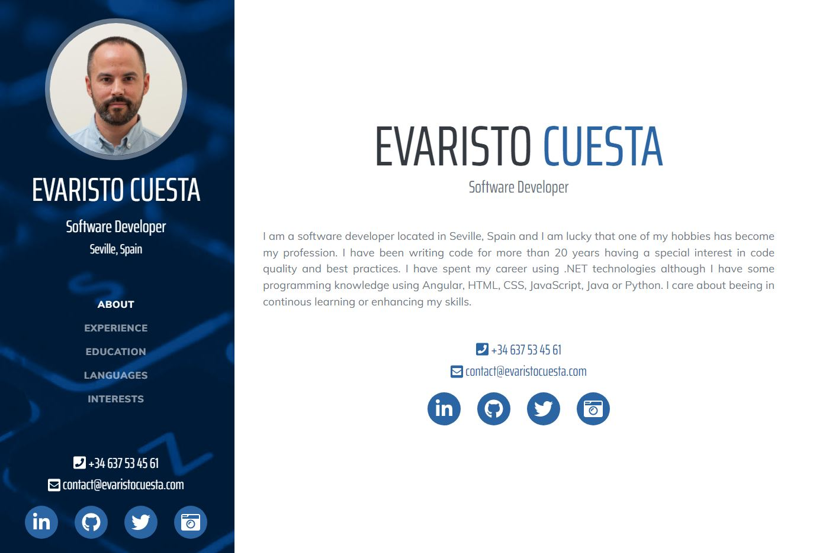

# [evaristocuesta.com](https://www.evaristocuesta.com)

Hi all, 

I'm Evaristo and I'm a software developer based in Seville, Spain. This is my website where you can view my CV. 

This website is based on [Resume](https://startbootstrap.com/theme/resume/) which is a resume and CV theme for [Bootstrap](https://getbootstrap.com/) created by [Start Bootstrap](https://startbootstrap.com/) but modified using ASP.NET Core MVC and SSG with AspNetStatic. 

If you want, you can fork or clone [this project](https://github.com/evaristocuesta/evaristocuesta.com) and use it as a template for your resume website. 

## Bugs and Issues

Have a bug or an issue with this template? [Open a new issue](https://github.com/evaristocuesta/evaristocuesta.com/issues) here on GitHub. 

## Credits

This website is based on Start BootStrap. 

Start Bootstrap is an open source library of free Bootstrap themes and templates. All of the free themes and templates on Start Bootstrap are released under the MIT license, which means you can use them for any purpose, even for commercial projects.

- <https://startbootstrap.com>
- <https://twitter.com/SBootstrap>

Start Bootstrap was created by and is maintained by **[David Miller](https://davidmiller.io/)**.

- <https://davidmiller.io>
- <https://twitter.com/davidmillerhere>
- <https://github.com/davidtmiller>

Start Bootstrap is based on the [Bootstrap](https://getbootstrap.com/) framework created by [Mark Otto](https://twitter.com/mdo) and [Jacob Thorton](https://twitter.com/fat).

Backgroud photo by [Athul Cyriac Ajay](https://unsplash.com/@athulca?utm_source=unsplash&utm_medium=referral&utm_content=creditCopyText) on [Unsplash](https://unsplash.com/?utm_source=unsplash&utm_medium=referral&utm_content=creditCopyText).
  

## License

Code released under the [MIT](https://github.com/evaristocuesta/evaristocuesta.com/blob/master/LICENSE) license.
